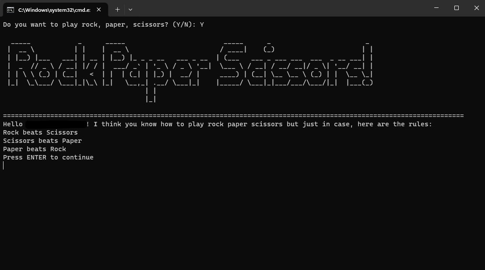

# Rock, Paper, Scissors! 
Rock, Paper, Scissors written in Python.
This is my first ever small project that I've created!
You can use the .bat file to open the game within the CMD window, I found it cool cause it reminds me of those old DOS games :P

I used some youtube tutorials and then knowledge from my first two Python classes.

## Screenshots

